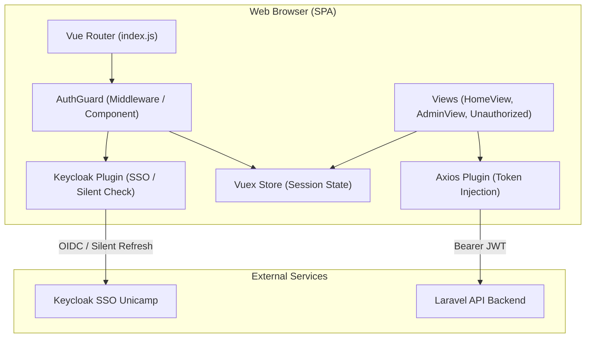

# Component Architecture Diagram (Frontend)

```mermaid
graph TD
    subgraph Browser ["Web Browser (SPA)"]
        Router["Vue Router (index.js)"]
        Guard["AuthGuard (Middleware / Component)"]
        Views["Views (HomeView, AdminView, Unauthorized)"]
        Store["Vuex Store (Session State)"]
        AxiosPlugin["Axios Plugin (Token Injection)"]
        KeycloakPlugin["Keycloak Plugin (SSO / Silent Check)"]
    end

    subgraph External ["External Services"]
        KeycloakServer["Keycloak SSO Unicamp"]
        LaravelAPI["Laravel API Backend"]
    end

    Router --> Guard
    Guard --> KeycloakPlugin
    Guard --> Store
    Views --> Store
    Views --> AxiosPlugin
    AxiosPlugin -->|Bearer JWT| LaravelAPI
    KeycloakPlugin -->|OIDC / Silent Refresh| KeycloakServer
```