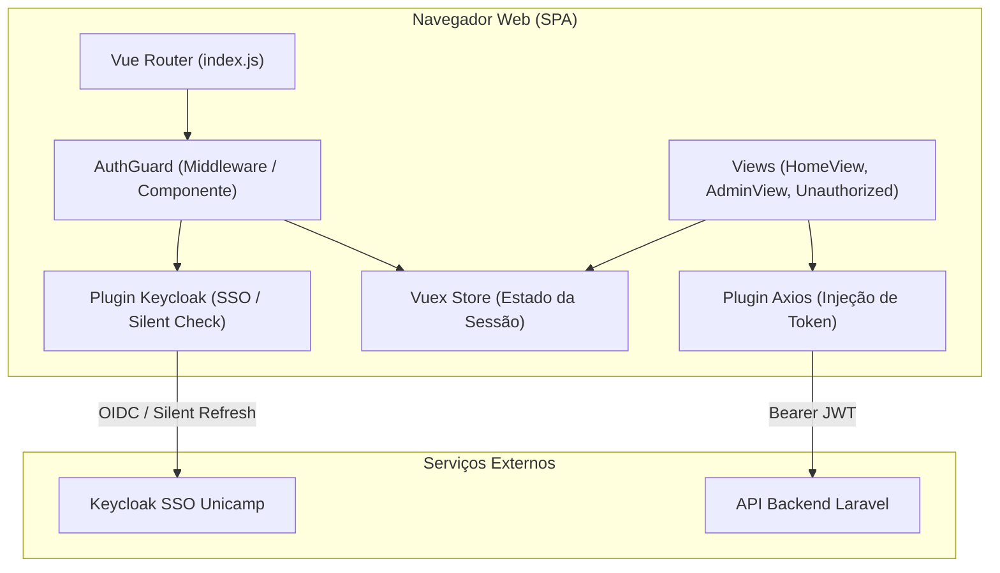

# Diagrama de Arquitetura de Componentes Frontend

```mermaid
graph TD
    subgraph Browser ["Navegador Web (SPA)"]
        Router["Vue Router (index.js)"]
        Guard["AuthGuard (Middleware / Componente)"]
        Views["Views (HomeView, AdminView, Unauthorized)"]
        Store["Vuex Store (Estado da Sessão)"]
        AxiosPlugin["Plugin Axios (Injeção de Token)"]
        KeycloakPlugin["Plugin Keycloak (SSO / Silent Check)"]
    end

    subgraph External ["Serviços Externos"]
        KeycloakServer["Keycloak SSO Unicamp"]
        LaravelAPI["API Backend Laravel"]
    end

    Router --> Guard
    Guard --> KeycloakPlugin
    Guard --> Store
    Views --> Store
    Views --> AxiosPlugin
    AxiosPlugin -->|Bearer JWT| LaravelAPI
    KeycloakPlugin -->|OIDC / Silent Refresh| KeycloakServer
```