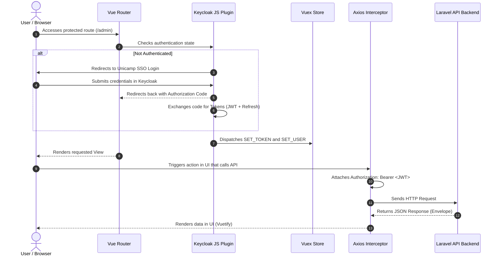

# SSO Authentication Flow Diagram (Frontend Keycloak)

```mermaid
sequenceDiagram
    autonumber
    actor User as User / Browser
    participant Router as Vue Router
    participant Keycloak as Keycloak JS Plugin
    participant Store as Vuex Store
    participant Axios as Axios Interceptor
    participant Backend as Laravel API Backend

    User->>Router: Accesses protected route (/admin)
    Router->>Keycloak: Checks authentication state
    
    alt Not Authenticated
        Keycloak->>User: Redirects to Unicamp SSO Login
        User->>Keycloak: Submits credentials in Keycloak
        Keycloak-->>Router: Redirects back with Authorization Code
        Keycloak->>Keycloak: Exchanges code for Tokens (JWT + Refresh)
    end

    Keycloak->>Store: Dispatches SET_TOKEN and SET_USER
    Router-->>User: Renders requested View

    User->>Axios: Triggers action in UI that calls API
    Axios->>Axios: Attaches Authorization: Bearer <JWT>
    Axios->>Backend: Sends HTTP Request
    Backend-->>Axios: Returns JSON Response (Envelope)
    Axios-->>User: Renders data in UI (Vuetify)
```