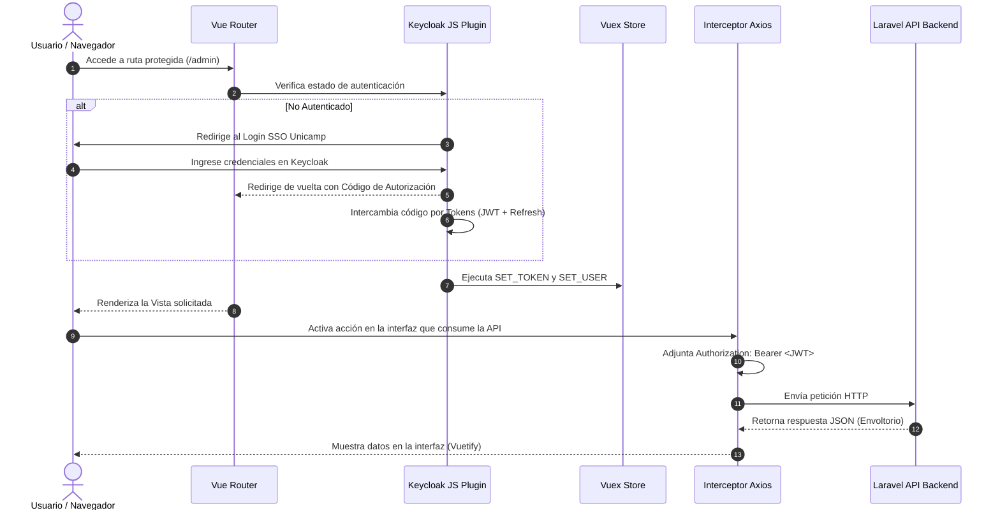

# Diagrama del Flujo de Autenticación SSO (Keycloak Frontend)

```mermaid
sequenceDiagram
    autonumber
    actor User as Usuario / Navegador
    participant Router as Vue Router
    participant Keycloak as Keycloak JS Plugin
    participant Store as Vuex Store
    participant Axios as Interceptor Axios
    participant Backend as Laravel API Backend

    User->>Router: Accede a ruta protegida (/admin)
    Router->>Keycloak: Verifica estado de autenticación
    
    alt No Autenticado
        Keycloak->>User: Redirige al Login SSO Unicamp
        User->>Keycloak: Ingrese credenciales en Keycloak
        Keycloak-->>Router: Redirige de vuelta con Código de Autorización
        Keycloak->>Keycloak: Intercambia código por Tokens (JWT + Refresh)
    end

    Keycloak->>Store: Ejecuta SET_TOKEN y SET_USER
    Router-->>User: Renderiza la Vista solicitada

    User->>Axios: Activa acción en la interfaz que consume la API
    Axios->>Axios: Adjunta Authorization: Bearer <JWT>
    Axios->>Backend: Envía petición HTTP
    Backend-->>Axios: Retorna respuesta JSON (Envoltorio)
    Axios-->>User: Muestra datos en la interfaz (Vuetify)
```