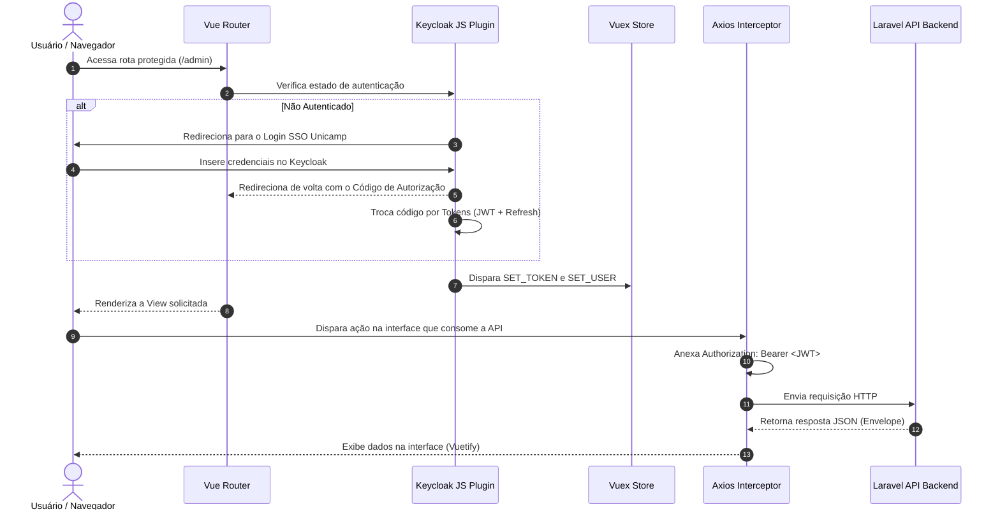

# Diagrama do Fluxo de Autenticação SSO (Keycloak Frontend)

```mermaid
sequenceDiagram
    autonumber
    actor Usuario as Usuário / Navegador
    participant Router as Vue Router
    participant Keycloak as Keycloak JS Plugin
    participant Store as Vuex Store
    participant Axios as Axios Interceptor
    participant Backend as Laravel API Backend

    Usuario->>Router: Acessa rota protegida (/admin)
    Router->>Keycloak: Verifica estado de autenticação
    
    alt Não Autenticado
        Keycloak->>Usuario: Redireciona para o Login SSO Unicamp
        Usuario->>Keycloak: Insere credenciais no Keycloak
        Keycloak-->>Router: Redireciona de volta com o Código de Autorização
        Keycloak->>Keycloak: Troca código por Tokens (JWT + Refresh)
    end

    Keycloak->>Store: Dispara SET_TOKEN e SET_USER
    Router-->>Usuario: Renderiza a View solicitada

    Usuario->>Axios: Dispara ação na interface que consome a API
    Axios->>Axios: Anexa Authorization: Bearer <JWT>
    Axios->>Backend: Envia requisição HTTP
    Backend-->>Axios: Retorna resposta JSON (Envelope)
    Axios-->>Usuario: Exibe dados na interface (Vuetify)
```